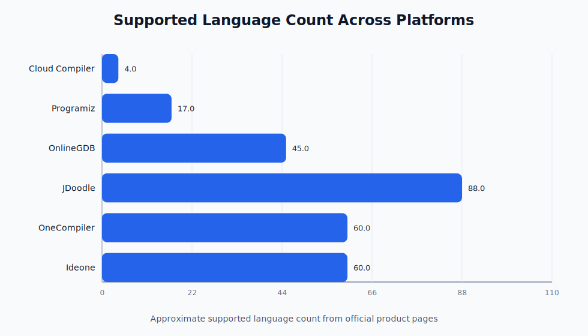
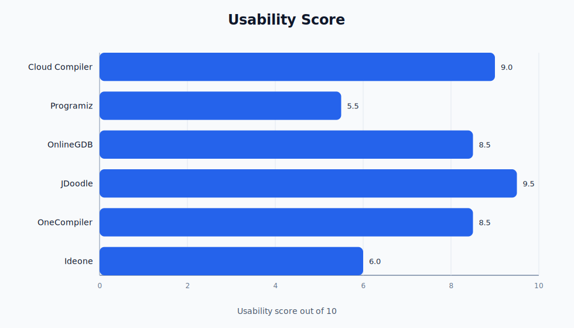
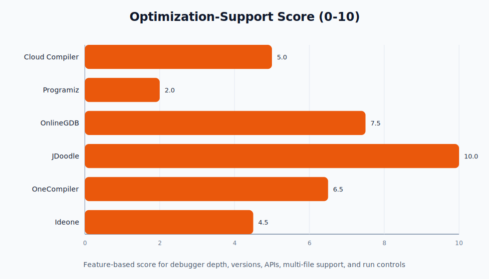
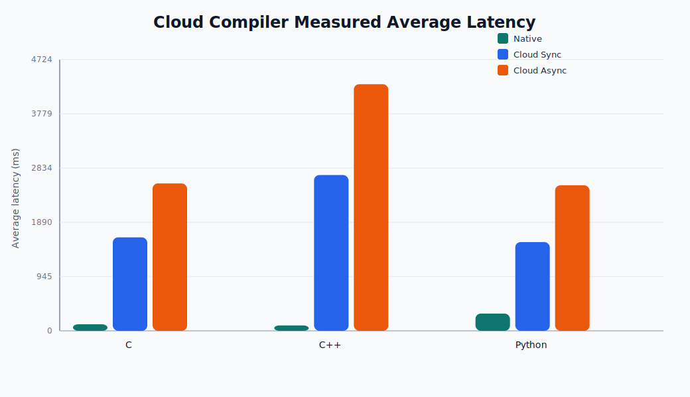

# Cloud Compiler Project Report

## Abstract

Cloud Compiler is a full-stack browser-based coding platform that lets users write, run, save, share, and monitor code execution without requiring local compiler installation. The current project combines a React and TypeScript frontend, a FastAPI backend, Redis-backed asynchronous execution, a Python worker service, Docker-based language runners, PostgreSQL-backed authentication, and admin metrics dashboards. In its current state, the project is no longer only a single-file online compiler. It now behaves more like a compact educational coding platform with multi-file projects, structured telemetry, and Java Swing browser workflows.

Generated from the repository state on **2026-03-28 19:58:10 UTC**.

## Current System Summary

### Core capabilities

- Browser-based coding workspace with Monaco editor
- Python, C, C++, and Java execution in isolated Docker containers
- Synchronous execution for immediate results
- Asynchronous execution through Redis queue + worker processing
- Multi-file projects with entry-file selection
- Compiler profiles and custom compiler flags
- Saved projects and public share links
- File import, code export, and PDF export
- Complexity analysis for supported languages
- Metrics dashboards for queue, workers, system state, and job timings
- Java Swing preview artifacts for regular runs
- Interactive Java Swing sessions through embedded noVNC

### High-level architecture

```text
+--------------------+        +--------------------------+
| Frontend           | -----> | FastAPI Backend          |
| React + Monaco UI  |        | Auth, execute, projects  |
+--------------------+        +-----------+--------------+
                                           |
                      +--------------------+--------------------+
                      |                                         |
                      v                                         v
             +--------------------+                  +--------------------+
             | Direct sync runner |                  | Redis queue        |
             | execution_engine   |                  | async job buffer   |
             +---------+----------+                  +---------+----------+
                       |                                       |
                       v                                       v
             +--------------------+                  +--------------------+
             | Docker containers  | <--------------  | Worker service     |
             | python/c/cpp/java  |                  | structured results |
             +--------------------+                  +--------------------+
```

## Implementation Status

| Area | Current condition |
| --- | --- |
| Authentication | JWT-based registration/login with PostgreSQL user records |
| Workspace | Multi-file editor, entry-file selection, stdin, compiler profile, flags |
| Execution | Sync + async container execution with structured result payloads |
| Persistence | Save/update/list/share project APIs with share IDs |
| Observability | Queue, worker, system, and job metrics in backend + frontend dashboards |
| Java UX | Swing preview for normal runs and interactive noVNC session support |
| Security | Container resource limits, disabled network in execution containers, text sanitization |

## Major Improvements Reflected in the Current Project

Compared with the earlier reports, the project has materially improved in the following ways:

1. Multi-file project support is implemented in the workspace and persisted through project APIs.
2. Save and share workflows are implemented, including public read-only project links.
3. Async execution now stores structured status, timings, diagnostics, stdout, stderr, and output fields.
4. Queue wait, compile time, execution time, and total time are surfaced in metrics dashboards.
5. Java Swing support now covers both preview capture and interactive browser sessions.
6. Compiler profile selection and custom compiler flags are already part of the execution payload.

## Detailed Feature Inventory

| Feature | Present now | Notes |
| --- | --- | --- |
| Multi-language execution | Yes | Python, C, C++, Java |
| Multi-file projects | Yes | Entry-file selection supported |
| Saved projects | Yes | User-owned project persistence |
| Public share links | Yes | Read-only shared project page |
| Sync execution | Yes | Immediate execution path |
| Async execution | Yes | Redis queue + worker path |
| Structured diagnostics | Yes | Status, summary, details, error stage |
| Timing telemetry | Yes | Queue wait, compile, execution, total time |
| Admin metrics UI | Yes | Queue, worker, latency, and system views |
| Compiler profiles | Yes | Language-specific profile options |
| Custom flags | Yes | User-configurable compiler/runtime flags |
| Swing preview | Yes | Returned as execution artifacts |
| Interactive Swing | Yes | Browser-embedded noVNC session |
| Step debugger | No | Still a future enhancement |
| Collaborative editing | No | Still a future enhancement |

## Benchmark Snapshot

Measured benchmark data was loaded from `reporting/compiler_comparison_results.json`.

| Language | Native avg (ms) | Cloud sync avg (ms) | Cloud async avg (ms) |
| --- | --- | --- | --- |
| C | 114.25 | 1627.46 | 2567.13 |
| C++ | 93.95 | 2712.69 | 4294.62 |
| Python | 300.59 | 1545.61 | 2533.95 |

### Benchmark interpretation

- Native local execution is still the fastest baseline.
- Cloud sync is the fastest managed mode inside the platform.
- Cloud async has the highest latency, but it is now also the most observable execution mode because it preserves structured lifecycle data.
- The benchmark does not capture the value of project persistence, sharing, dashboards, or interactive Swing sessions, so optimization results should be read together with usability findings.

## Optimization and Usability Positioning

### Optimization

- The project is optimized for safe browser-based execution rather than raw compiler speed.
- Docker startup, bind mounts, and queue handling add overhead compared with native local execution.
- The current architecture improves operational quality by returning structured telemetry and making async execution measurable.

### Efficient usability

- The platform now supports a complete user workflow: write, run, save, share, reopen, and monitor.
- Multi-file support and compiler configuration make the workspace meaningfully more practical for real coursework and demos.
- Java Swing support is a distinctive feature because it extends the platform beyond console-only programs.

## Current Limitations

The current project is much stronger than the earlier report described, but some limitations still remain:

- No built-in step debugger or breakpoint tooling
- Interactive Swing sessions are local-only and would need backend proxying for safer remote deployment
- Language coverage is still limited compared with large commercial online compilers
- Collaboration is link-based rather than live multi-user editing
- Full automated regression coverage for execution, share flow, and telemetry can still be expanded

## Recommended Next Steps

1. Add debugger-oriented tooling or richer runtime trace capture.
2. Proxy interactive sessions through authenticated backend routes for production use.
3. Expand supported compiler versions and languages if competitive breadth matters.
4. Add collaboration features such as comments, instructor review, or live editing.
5. Add CI-backed benchmark and regression pipelines so future report updates stay reproducible.

## Conclusion

Cloud Compiler has evolved from a basic distributed execution demo into a more complete coding platform. The current version supports multi-file workspaces, save/share flows, structured async telemetry, dashboard observability, and specialized Java Swing workflows. Its main competitive advantage is not raw execution speed; it is the combination of browser accessibility, isolated execution, operational visibility, and practical usability features in a single project.

## Appendix: Report Assets

- Benchmark data: `reporting/compiler_comparison_results.json`
- Measured comparison report: `reporting/Compiler_Comparison_Final_Report.md`
- Market/platform comparison report: `reporting/Compiler_Platform_Comparison_Report.md`








